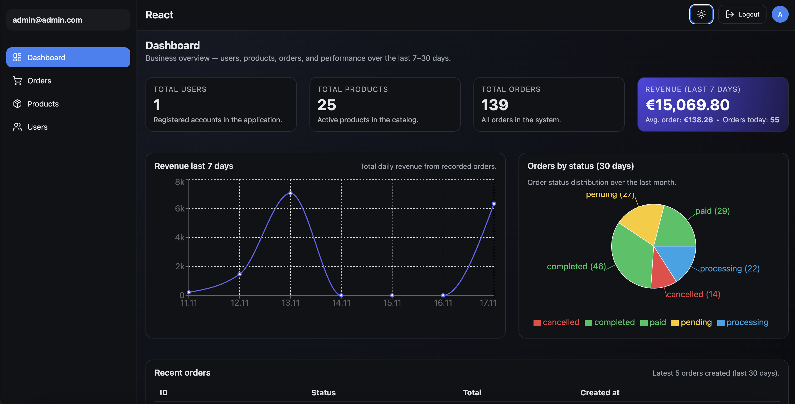
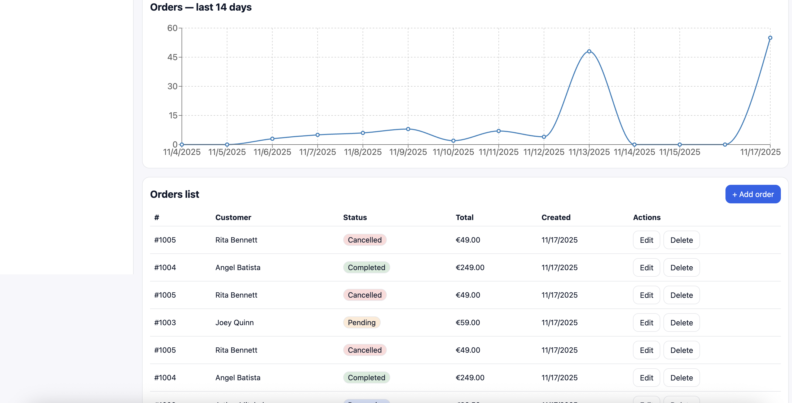
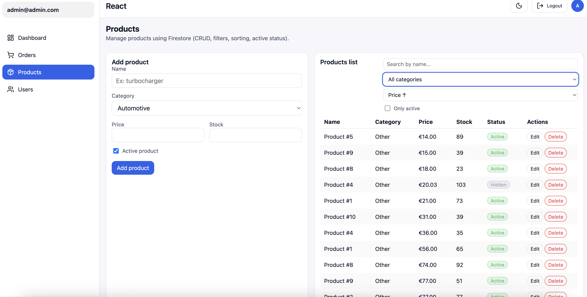
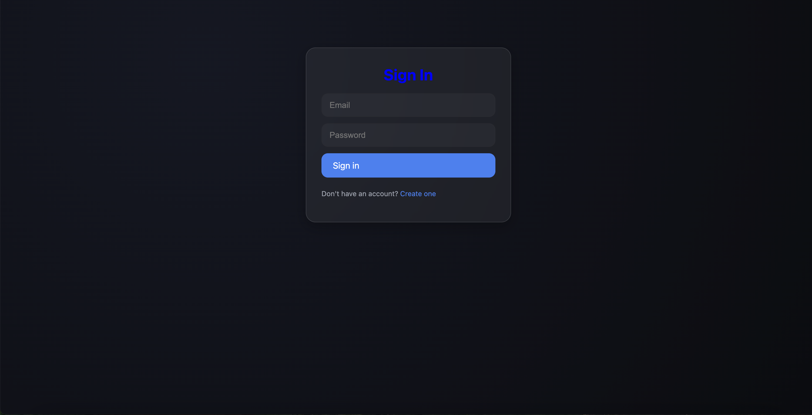
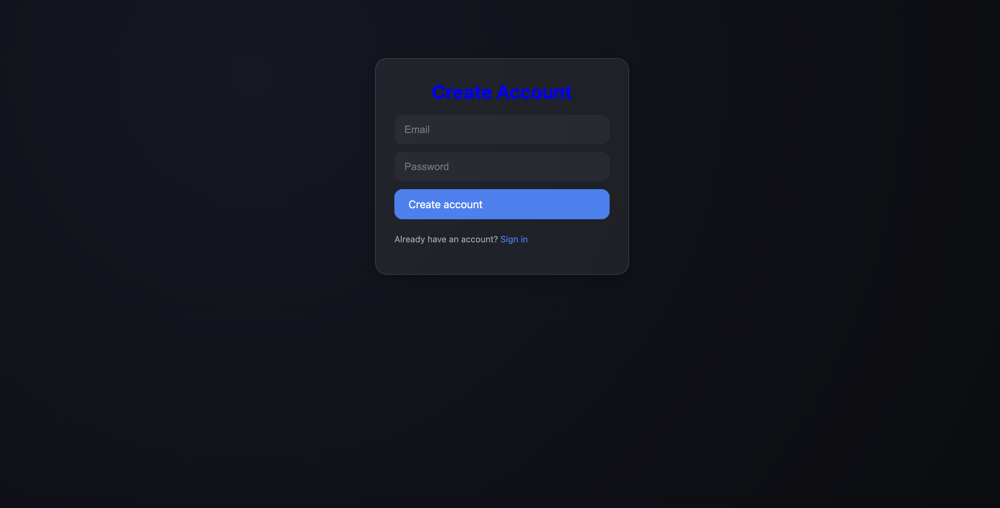
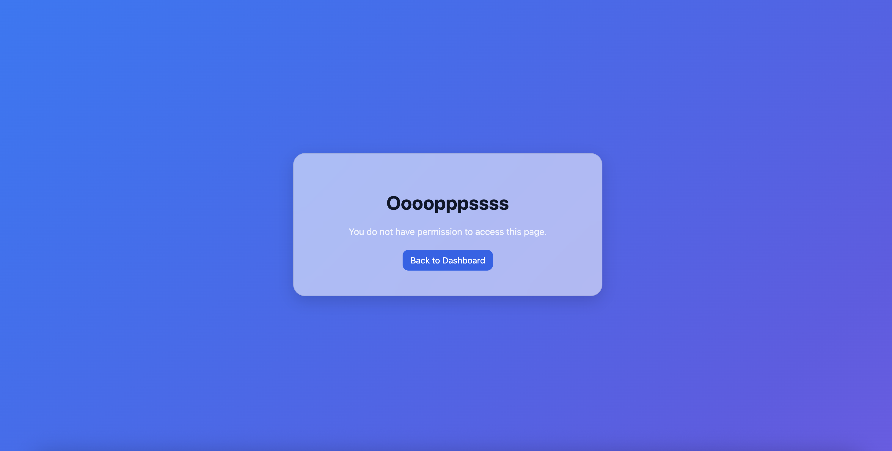
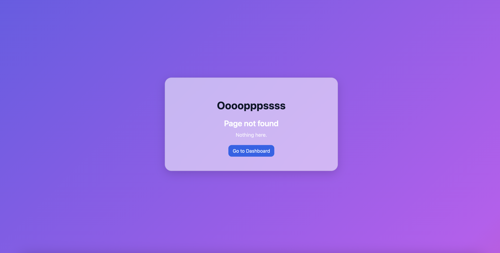

# React Admin Dashboard (Firebase + Vite + TypeScript)

A modern admin dashboard built with **React + TypeScript + Vite**, featuring **authentication, user roles, Firestore CRUD, real-time data updates, charts and theme switching**.

Designed as a real-world portfolio project suitable for full-stack / frontend interviews.

## 🚀 Live Demo
https://react-admin-dashboard-git-main-silviuangheluta14s-projects.vercel.app

## Admin
email: admin@admin.com
password: 123456

## 📸 Preview

 📊 Dashboard


 🧾 Orders


 🛒 Products


 👥 Users & Roles


 🔐 Login & Register



 🚫 Access Control (403 Not Authorized)


 ❓ Custom 404 Page


## 🔥 Features

 ## ✨ Features

### 🔐 Authentication & Authorization
- Firebase Auth (email/password)
- Persistent session
- Role-based access control (admin / user)
- Protected routes using React Router
- Unauthorized fallback (403 page)

### 🧾 Orders Management
- Live Firestore sync (real-time updates)
- Add / Edit / Delete orders
- Order status badges
- Revenue calculation
- Last 7 days chart

### 🛒 Products Management
- CRUD + form validation
- Stock, price, active state
- Filtering & searching

### 👥 User Management
- Role switching (user/admin)
- Enable / disable accounts
- Firestore document deletion
- Filters & search
- Demo admin account support

### 📊 Dashboard
- Realtime Firestore stats
- User / Product / Order counts
- 7-day revenue chart
- Order distribution chart

### 🎨 UI / UX
- Light & Dark mode with theming
- Fully responsive layout
- Modern minimalist design
- Clean reusable components

### ⚡ Tech Stack
| Category | Tech |
|----------|------|
| UI | React 18 · TypeScript · Vite |
| State | Zustand (global store) |
| Backend | Firebase Auth · Firestore (realtime) |
| Charts | Recharts |
| Styling | Custom CSS · CSS variables · Dark/Light mode |
| Routing | React Router v6 |
| Deployment | Vercel |
| Dev Tools | ESLint · Prettier · Git · GitHub |


## 🛠️ Project Structure

src/
├─ components/
├─ pages/
├─ utils/
├─ store/
├─ styles/
└─ App.tsx


## 🧪 Demo Data
The project includes seeding utilities for development:

```ts
import { seedProducts, seedUsers } from './utils/seed';

// seedProducts(20);
// seedUsers(10);
